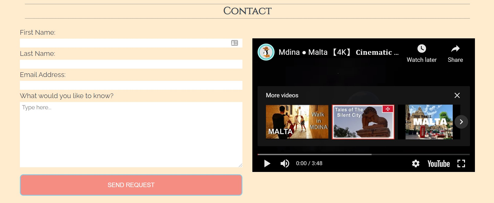

# MDINA - THE SILENT CITY WITH A STORY TO TELL

‘Mdina – The Silent City with a Story to Tell’ is a site that hopes to introduce people to some of the historically significant locations found around Mdina, Malta.  The site will be targeted towards history enthusiasts and travellers looking for more information about the various locations found in Mdina.  

## USER EXPERIENCE

### USER STORIES

* First Time Visitor Goals

As a First Time Visitor, I want to be able to navigate the page to find content with ease.

As a First Time Visitor, I want to be able to find information about the historical buildings in Mdina without being overwhelmed with content.

## FEATURES

### Existing Features

* Navigation Bar
    - Fixed at the top of the screen.
    - As site is a single page site, this will allow users to navigate between sections without having to return to the top of the page.

* Title Hero Image
    - Includes a full-screen photograph with a text overlay to allow the user to see what this site contains. 
    - The image was chosen as it is representative of Mdina’s history and present.
    - The text does not obscure the key details of the picture.

* History Section
    - Site’s only text-heavy section containing a brief history of the city as a whole.  As site is focussed towards history enthusiasts and travellers, having accurate historical content first establishes credibility. 
    - Contains two images for decorative purposes.

* Notable Buildings Section
    - Contains eight images of different buildings around Mdina.  Each image serves as a link to the building’s dedicated Wikipedia page (which opens in a new window).  Using the building’s image allows users to quickly access the building’s information when they are physically present in Mdina – thus using it as a reference.
    - In the desktop view, a transition effect will be visible.  When the user hovers over an image, the image will turn grey and the building name will appear.
    - In the mobile view, there is no hover effect, each building name will be present on the image.

* How to Find Us Section
    - Does not contain information on how to find Mdina, but does contain links to a tourist information site on how to get there by bus, bu car and on foot.
     - As the site is primarily designed with a focus on history, it was decided that this information should be simple with few details.
    - There are three sections each with a button to an external page which opens in a new tab.

* Contact Section
    - Contains a form and a video about Mdina.  
    - This section allows users to get in touch if they have any questions about Mdina or the content displayed on the page.
    - This feature is currently inactive (see below)
     - The video is present to give users an alternative view of Mdina which can be watched while filling in the form on the desktop version.  For mobile devices, the video is below the form.

* Footer
    - This section contains links to relevant social media sites which will open in separate tabs for easy navigation for the user.
    - The footer is valuable to the user as it encourages them to keep connected via social media

### Features remaining to be implemented

**Navigation Bar** 
* currently the navigation bar isn’t fully responsive for mobile devices.  In the future, this will change to a fixed, hamburger drop-down menu.

**Contact Form**
* Currently the contact form is a visual representation only with no interactivity.  This will need to be implemented.

## Testing
**HTML**
* No errors detected when run through the official [W3C validator](https://validator.w3.org/nu/?doc=https%3A%2F%2Fdougiemath.github.io%2Fproject-1%2F)

**CSS**
* CSS – no errors were found when passing through the official [W3C CSS Validation Service](https://jigsaw.w3.org/css-validator/validator?uri=https%3A%2F%2Fdougiemath.github.io%2Fproject-1%2F&profile=css3svg&usermedium=all&warning=1&vextwarning=&lang=en)

**Lighthouse**
* Results from Lighthouse testing:

## Deployment

The site is currently live and deployed in GitHub: https://dougiemath.github.io/project-1/ 

## Credits

**Content**

Adapted from [Mdina Wikipedia](https://en.wikipedia.org/wiki/Mdina)

**Images**

[Banca Giurtale](https://commons.wikimedia.org/wiki/File:Mdina_St_Agatha_chapel.JPG#/media/File:Mdina_St_Agatha_chapel.JPG)

[Corte Capitanale](https://commons.wikimedia.org/wiki/File:Mdina_St_Agatha_chapel.JPG#/media/File:Mdina_St_gatha_chapel.JPG)

[Greek’s Gate](https://commons.wikimedia.org/wiki/File:Bieb_il-Griegi.jpg#/media/File:Bieb_il-Griegi.jpg)

[Mdina Gate](https://pixabay.com/images/id-1988027/)

[St Agatha’s Chapel](https://commons.wikimedia.org/wiki/File:Mdina_St_Agatha_chapel.JPG#/media/File:Mdina_St_Agatha_chapel.JPG)

[St Paul’s Cathedral](https://pixabay.com/images/id-2059102/)

[St Roque’s Chapel](https://commons.wikimedia.org/wiki/File:Mdina_St_Agatha_chapel.JPG#/media/File:Mdina_St_Agatha_chapel.JPG)

[Vilhena Palace](https://pixabay.com/images/id-1988027/)

[Iron-wrought relief of Phonecian Ship](https://commons.wikimedia.org/wiki/File:Fenisisk_b%C3%A5t_p%C3%A5_h%C3%A4llristning.png#/media/File:Fenisisk_båt_på_hällristning.png)

[Aerial View of Mdina](https://www.pexels.com/photo/aerial-view-of-brown-concrete-building-7681934/?utm_content=attributionCopyText&utm_medium=referral&utm_source=pexels)

[Header](https://pixabay.com/images/id-3913077/)

Remaining Images from personal collection.

**Video**

[Mdina - 4K Cinematic Drone](https://www.youtube.com/watch?v=q_7-Lx3Xm2g)

**Icons**

Font Awesome - https://fontawesome.com/

**Fonts**

Google Fonts - https://fonts.google.com/